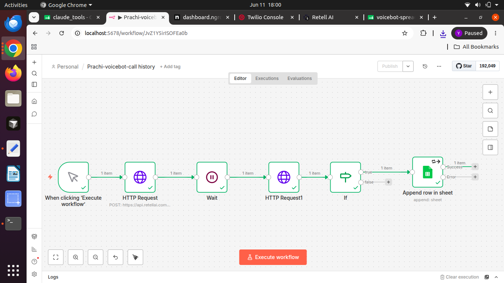

# Retell AI to Google Sheets Automation via n8n

An automated workflow that catches post-call webhooks from Retell AI, validates data routing, and appends extracted customer data (Name, Address, DOB) straight into a Google Sheet.

## 🚀 Features
- **Webhook Integration**: Real-time call data capture.
- **Fail-Safe Routing**: Uses condition logic to filter processing statuses.
- **Auto-Formatting**: Ensures robust structural logging.

## 🛠️ Setup Instructions
1. Copy the contents of the `workflow.json` file in this repo.
2. Open your n8n instance, hit `Ctrl + V` on the canvas, and paste.
3. Connect your own **Retell AI API Key** via Predefined Credentials (HTTP Basic Auth).
4. Authenticate your own **Google Sheets Account** and select your spreadsheet.

## 📊 Workflow Architecture

